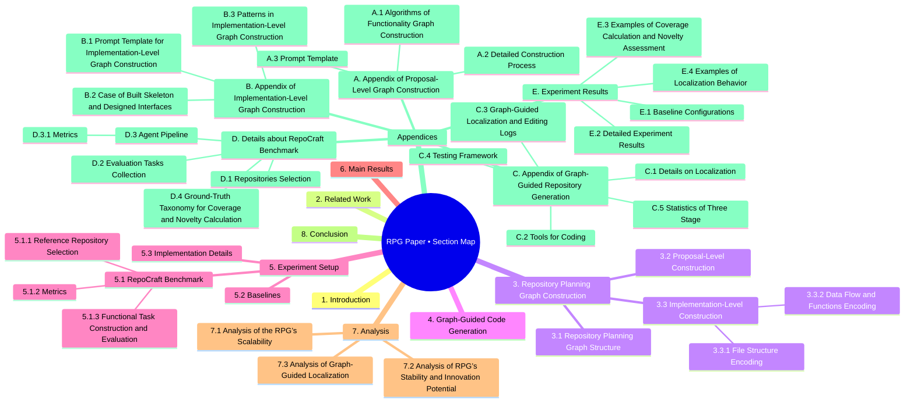
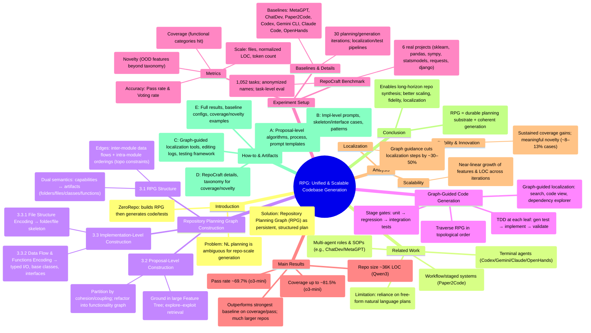

# RPG Starter





<p>

</p>

<p>

</p>

```bash
1. Introduction
   • Frames the gap between NL plans and whole-repo synthesis; proposes RPG as a persistent graph unifying proposal + implementation; introduces ZeroRepo pipeline and headline results on RepoCraft.

2. Related Work
   • Surveys multi-agent/workflow/vibe-coding approaches; argues they falter due to NL ambiguity and lack of persistent structure—motivating a graph representation.

3. Repository Planning Graph Construction
   3.1 Repository Planning Graph Structure
   • RPG nodes carry dual meaning (capability ↔ artifact); edges encode dataflow/order to impose a topo plan mirroring code layout.
   3.2 Proposal-Level Construction
   • Ground capabilities in a large Feature Tree; explore–exploit to grow a repo-aligned subtree; refactor into cohesive modules.
   3.3 Implementation-Level Construction
   • Map modules to folders/files; add typed flows; abstract base interfaces; refine leaves into concrete classes/functions.
   • 3.3.1 File Structure Encoding
   – Assign subtrees to directories and features to files to get a file-augmented graph that preserves cohesion.
   • 3.3.2 Data Flow and Functions Encoding
   – Add inter/intra-module IO constraints, introduce base classes, and design per-file interfaces to finalize the RPG.

4. Graph-Guided Code Generation
   • Traverse RPG in topological order; TDD at each leaf; use graph-guided localization + majority-vote diagnosis to fix or proceed.

5. Experiment Setup
   5.1 RepoCraft Benchmark
   • Defines an end-to-end repo-from-scratch benchmark (6 projects, 1,052 tasks) evaluating coverage, accuracy, and scale.
   • 5.1.1 Reference Repository Selection
   – Chooses six widely used Python repos; paraphrases names to reduce leakage.
   • 5.1.2 Metrics
   – Coverage (category hit rate), Novelty (OOD share), Accuracy (pass/vote), Code scale (files/LOC/tokens).
   • 5.1.3 Functional Task Construction and Evaluation
   – Harvest/stratify tests → NL task + ground truth; localize → validate → adapt/execute tests.
   5.2 Baselines
   • Compares multi-agent, workflow, and terminal agents under generous iteration budgets.
   5.3 Implementation Details
   • Iteration counts and limits for selection, debugging, localization, and error attribution.

6. Main Results
   • ZeroRepo + RPG yields much higher coverage/pass rates and far larger repos vs. baselines; closest to human “Gold Projects.”

7. Analysis
   7.1 RPG’s Scalability
   • Feature count and LOC scale near-linearly across iterations with RPG (vs. baseline stagnation).
   7.2 RPG’s Stability & Innovation Potential
   • Coverage climbs toward completeness while sustaining coherent novelty additions.
   7.3 Graph-Guided Localization
   • RPG reduces localization steps ~30–50% across tasks by giving structure-aware search paths.

8. Conclusion
   • RPG is an effective, persistent planning substrate enabling scalable, accurate repo generation and faster localization.

Appendices (what each delivers at a glance)
A. Proposal-Level Graph Construction
• Algorithms, detailed iteration traces, prompt templates for exploit/explore/missing-feature retrieval.
A.1 Algorithms of Functionality Graph Construction
• Rejection sampling for diversity; subtree build with LLM-filtered explore–exploit.
A.2 Detailed Construction Process
• Feature-tree stats, model-specific growth patterns, distribution shifts from global → repo.
A.3 Prompt Template
• Ready-to-use prompts for selection/self-check/missing-feature proposals.

B. Implementation-Level Graph Construction
• Prompts and exemplars to map subgraphs → skeletons, base classes, and interfaces.
B.1 Prompt Template (Implementation Level)
• Data-flow DAG spec, folder/file skeleton mapping, feature→file assignments.
B.2 Case: Built Skeleton & Designed Interfaces
• End-to-end example skeleton + interface designs (signatures/docstrings).
B.3 Patterns
• Isomorphism insights: subgraphs ↔ code regions; density/granularity trends by model.

C. Graph-Guided Repository Generation
• Tooling + logs for localization/editing; testing pipeline details.
C.1 Details on Localization
• Interface/file map tools and functionality search; terminate with ranked results.
C.2 Tools for Coding
• Edit primitives (class/method/function/imports) with strict outputs.
C.3 Localization & Editing Logs
• Worked traces showing search → patch flow.
C.4 Testing Framework
• Patch-oriented unit/regression/integration orchestration with auto-repair.
C.5 Statistics of Three Stage
• Localization efficiency and success/coverage tables across repos/models.

D. RepoCraft Benchmark Details
• Curation, task pipeline, agent pipeline, metric math.
D.1 Repositories Selection
• Rationale/scoping and anonymization.
D.2 Evaluation Tasks Collection
• From test harvest to NL tasks with sampling/filtering taxonomy.
D.3 Agent Pipeline
• Three-stage: localize → majority-vote validate → adapt tests.
D.3.1 Metrics
• Formal definitions (coverage, novelty, accuracy, code scale).
D.4 Ground-Truth Taxonomy
• Reference category trees used for coverage/novelty.

E. Experiment Results
• Full configs and per-repo breakdowns with novelty counts and scale.
E.1 Baseline Configurations
• How each baseline was run (roles, workflows, terminal agents).
E.2 Detailed Results
• Tables per repo/model (Cov/Nov/Pass/Vote/Files/LOC/Tokens).
E.3 Coverage & Novelty Examples
• Concrete category hits and OOD feature additions.
E.4 Localization Behavior
• Aggregated call-pattern analysis showing structured, convergent search.
```

## Umbrella terms

**Reusable cheat sheet — “Key ideas & how to apply them.”**

To address the ambiguity of natural language plans, we propose the Repository Planning Graph (RPG), a structured
representation that encodes repository functionality and implementation logic as nodes and edges. Building on RPG, we
develop ZeroRepo, a framework for repository generation from scratch. This section first introduces the structure of RPG
(§3.1), and then explains how ZeroRepo constructs it through proposal-level planning (§3.2) and implementation-level
refinement (§3.3). The overall pipeline is shown in Figure 1(A-B).


Analysis of Novelty Examples The novelty cases illustrate two key observations. First, novelty captures meaningful
extensions rather than random noise: in MLKit-Py, we see coherent additions such as Prophet forecasting, STL
decomposition, and genetic programming feature synthesis, while in StatModeler new capabilities include vector
autoregression and Cox proportional hazards models. Second, the new functionalities proposed by the RPG remain
reasonable within the target domain: they extend statistical modeling, optimization, or robustness analysis in ways
that align with real-world software evolution. Together, these examples confirm that the RPG supports not only stable
replication of reference repositories but also the introduction of coherent and domain-consistent innovations.


Graph guidance structures localization into systematic search. Figure 13 shows that with graph guidance,
localization behavior follows a structured CCG pattern (Coarse Search → Content Inspection → Global Graph Exploration).

 The agent begins by traversing the RPG at a coarse level to identify high-level candidates, then inspects
content-rich nodes for detailed signals, and finally explores semantically related structures across the graph. Termination
calls rise as the search converges. This progression indicates that the RPG reshapes the agent’s behavior into a
systematic, relation-aware search process, replacing ad hoc or repetitive probing.

## Install

pnpm i
pnpm build

## Try the CLI


## Run MCP server (stdio)

pnpm dev:mcp

### Connect from a compatible MCP client
