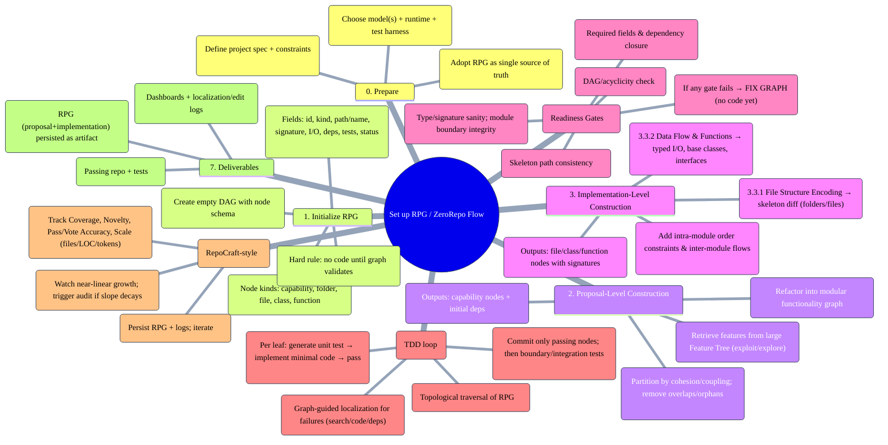
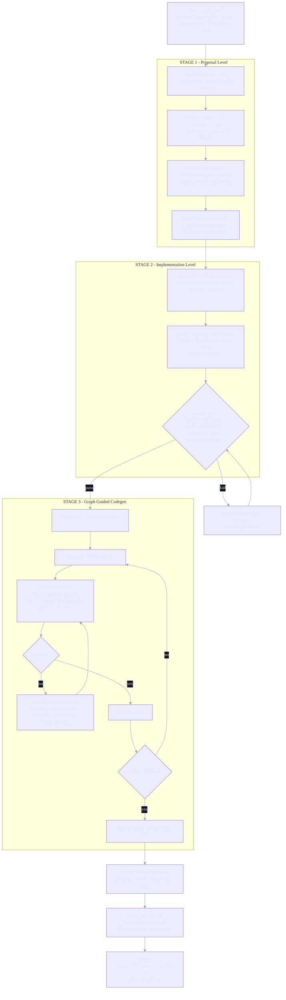
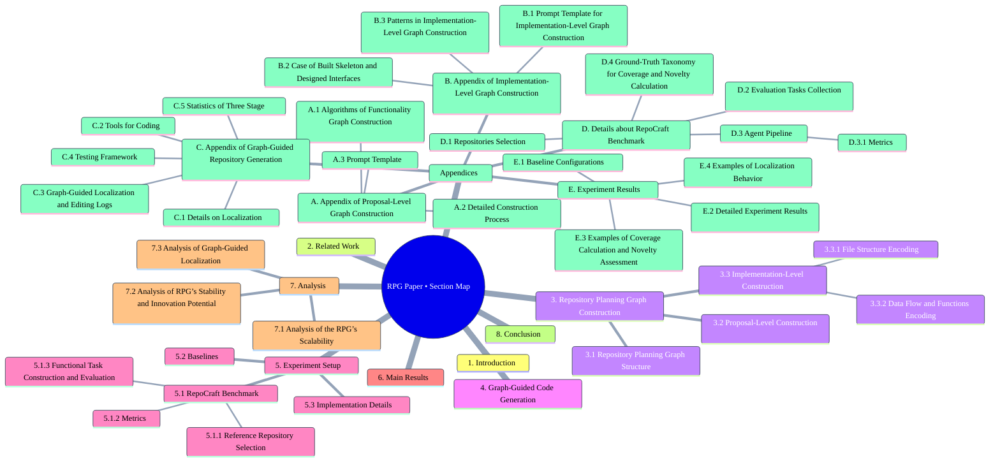
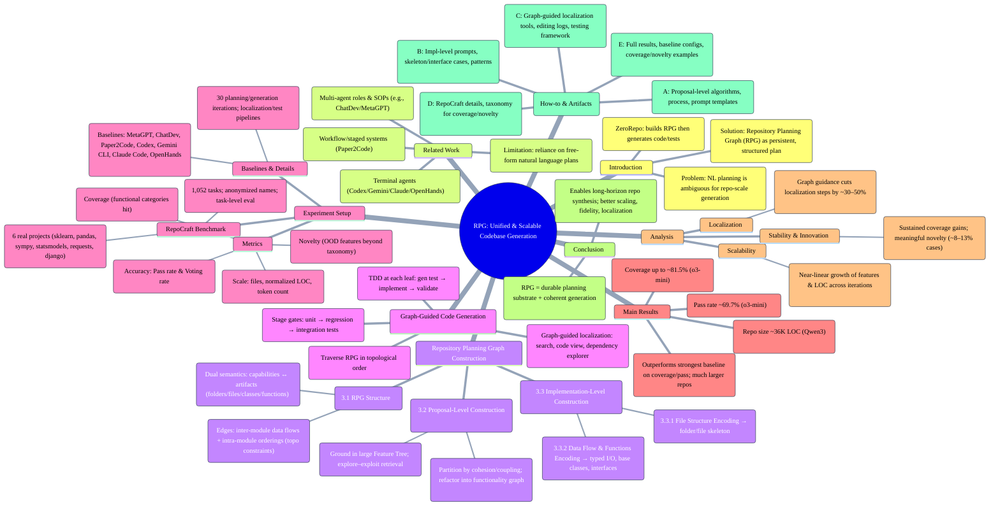

# Mermaid Graphs

```mermaid
%%{init: {
  "theme": "",
  "themeVariables": {
    "darkMode": true,
    "background": "#0b1220",
    "textColor": "#e5e7eb",
    "primaryColor": "#111827",
    "primaryTextColor": "#e5e7eb",
    "secondaryColor": "#0f172a",
    "secondaryTextColor": "#e5e7eb",
    "tertiaryColor": "#0b1220",
    "lineColor": "#94a3b8",
    "edgeLabelBackground": "#0b1220",
    "fontFamily": "Inter, ui-sans-serif, system-ui, Segoe UI, Arial",
    "fontSize": "15px"
  },
  "themeCSS": ".mindmap-node rect, .mindmap-node circle, .mindmap-node path{stroke:#334155} .edgePaths path{stroke:#94a3b8}"
}}%%
mindmap
  root((Set up RPG / ZeroRepo Flow))
    0. Prepare
      ("Define project spec + constraints")
      ("Adopt RPG as single source of truth")
      ("Choose model(s) + runtime + test harness")
    1. Initialize RPG
      ("Create empty DAG with node schema")
      ("Node kinds: capability, folder, file, class, function")
      ("Fields: id, kind, path/name, signature, I/O, deps, tests, status")
      ("Hard rule: no code until graph validates")
    2. Proposal-Level Construction
      ("Retrieve features from large Feature Tree (exploit/explore)")
      ("Refactor into modular functionality graph")
      ("Partition by cohesion/coupling; remove overlaps/orphans")
      ("Outputs: capability nodes + initial deps")
    3. Implementation-Level Construction
      ("3.3.1 File Structure Encoding → skeleton diff (folders/files)")
      ("3.3.2 Data Flow & Functions → typed I/O, base classes, interfaces")
      ("Add intra-module order constraints & inter-module flows")
      ("Outputs: file/class/function nodes with signatures")
    4. Validate RPG (Readiness Gates)
      ("DAG/acyclicity check")
      ("Required fields & dependency closure")
      ("Type/signature sanity; module boundary integrity")
      ("Skeleton path consistency")
      ("If any gate fails → FIX GRAPH (no code yet)")
    5. Graph-Guided Generation (TDD loop)
      ("Topological traversal of RPG")
      ("Per leaf: generate unit test → implement minimal code → pass")
      ("Graph-guided localization for failures (search/code/deps)")
      ("Commit only passing nodes; then boundary/integration tests")
    6. CI & Metrics (RepoCraft-style)
      ("Track Coverage, Novelty, Pass/Vote Accuracy, Scale (files/LOC/tokens)")
      ("Watch near-linear growth; trigger audit if slope decays")
      ("Persist RPG + logs; iterate")
    7. Deliverables
      ("Passing repo + tests")
      ("RPG (proposal+implementation) persisted as artifact")
      ("Dashboards + localization/edit logs")


```

```mermaid
%%{init: {
  "theme": "",
  "themeVariables": {
    "darkMode": true,
    "background": "#0b1220",
    "textColor": "#e5e7eb",
    "primaryColor": "#111827",
    "primaryTextColor": "#e5e7eb",
    "secondaryColor": "#0f172a",
    "secondaryTextColor": "#e5e7eb",
    "tertiaryColor": "#0b1220",
    "lineColor": "#94a3b8",
    "edgeLabelBackground": "#0b1220",
    "fontFamily": "Inter, ui-sans-serif, system-ui, Segoe UI, Arial",
    "fontSize": "15px"
  },
  "themeCSS": ".mindmap-node rect, .mindmap-node circle, .mindmap-node path{stroke:#334155} .edgePaths path{stroke:#94a3b8}"
}}%%
flowchart TB
  A[Start / Project Spec\nDomain, Lang/Runtime, Policies\nDependencies, Nonfunctional reqs] --> B

  subgraph S1[STAGE 1 - Proposal Level]
    B[Create empty RPG DAG\nNode schema, required fields, acyclic] --> C
    C[Retrieve features from taxonomy or corpus\nExploit top k, explore new branches] --> D
    D[Partition into modules\nMax cohesion, min coupling\nRemove overlaps and orphans] --> E
    E[Functionality graph ready\nCapabilities to modules\nDraft inter module deps]
  end

  subgraph S2[STAGE 2 - Implementation Level]
    E --> F[Encode file and folder skeleton\nMap modules to folders and files\nDiff only, no code]
    F --> G[Encode data flows and interfaces\nTyped IO, base classes, concrete funcs\nOrder constraints]
    G --> H{Validation gates\nDAG and dep closure\nSchema completeness\nType and IO sanity\nModule boundaries}
  end

  H -- pass --> I[Freeze RPG v1 as source of truth]
  H -- fail --> Hfix[Refactor nodes, edges, signatures\nRun validators again] --> H

  subgraph S3[STAGE 3 - Graph Guided Codegen]
    I --> J[Topological traverse leaves]
    J --> K[Per node TDD loop\nStep 1 - generate unit test\nStep 2 - minimal implementation\nStep 3 - run tests]
    K --> L{Tests pass}
    L -- no --> Kfix[Localize with graph tools\nSearch by capability, view interfaces, dep explorer\nPatch and retest] --> K
    L -- yes --> M[Commit node]
    M --> N{Subgraph complete}
    N -- yes --> O[Run integration and regression tests]
    N -- no --> J
  end

  O --> P[CI and metrics dashboard\nCoverage, novelty, pass or vote, scale]
  P --> Q[Persist RPG and logs\nVersioned RPG, edit and localization logs, test artifacts]
  Q --> R[Iterate\nAdmit OOD features in novelty lane\nContract aware edits]

```

```mermaid
%%{init: {
  "theme": "",
  "themeVariables": {
    "darkMode": true,
    "background": "#0b1220",
    "textColor": "#e5e7eb",
    "primaryColor": "#111827",
    "primaryTextColor": "#e5e7eb",
    "secondaryColor": "#0f172a",
    "secondaryTextColor": "#e5e7eb",
    "tertiaryColor": "#0b1220",
    "lineColor": "#94a3b8",
    "edgeLabelBackground": "#0b1220",
    "fontFamily": "Inter, ui-sans-serif, system-ui, Segoe UI, Arial",
    "fontSize": "15px"
  },
  "themeCSS": ".mindmap-node rect, .mindmap-node circle, .mindmap-node path{stroke:#334155} .edgePaths path{stroke:#94a3b8}"
}}%%
mindmap
  root((RPG Paper • Section Map))
    1. Introduction
    2. Related Work
    3. Repository Planning Graph Construction
      3.1 Repository Planning Graph Structure
      3.2 Proposal-Level Construction
      3.3 Implementation-Level Construction
        3.3.1 File Structure Encoding
        3.3.2 Data Flow and Functions Encoding
    4. Graph-Guided Code Generation
    5. Experiment Setup
      5.1 RepoCraft Benchmark
        5.1.1 Reference Repository Selection
        5.1.2 Metrics
        5.1.3 Functional Task Construction and Evaluation
      5.2 Baselines
      5.3 Implementation Details
    6. Main Results
    7. Analysis
      7.1 Analysis of the RPG’s Scalability
      7.2 Analysis of RPG’s Stability and Innovation Potential
      7.3 Analysis of Graph-Guided Localization
    8. Conclusion
    Appendices
      A. Appendix of Proposal-Level Graph Construction
        A.1 Algorithms of Functionality Graph Construction
        A.2 Detailed Construction Process
        A.3 Prompt Template
      B. Appendix of Implementation-Level Graph Construction
        B.1 Prompt Template for Implementation-Level Graph Construction
        B.2 Case of Built Skeleton and Designed Interfaces
        B.3 Patterns in Implementation-Level Graph Construction
      C. Appendix of Graph-Guided Repository Generation
        C.1 Details on Localization
        C.2 Tools for Coding
        C.3 Graph-Guided Localization and Editing Logs
        C.4 Testing Framework
        C.5 Statistics of Three Stage
      D. Details about RepoCraft Benchmark
        D.1 Repositories Selection
        D.2 Evaluation Tasks Collection
        D.3 Agent Pipeline
          D.3.1 Metrics
        D.4 Ground-Truth Taxonomy for Coverage and Novelty Calculation
      E. Experiment Results
        E.1 Baseline Configurations
        E.2 Detailed Experiment Results
        E.3 Examples of Coverage Calculation and Novelty Assessment
        E.4 Examples of Localization Behavior
```

```mermaid
%%{init: {
  "theme": "",
  "themeVariables": {
    "darkMode": true,
    "background": "#0b1220",
    "textColor": "#e5e7eb",
    "primaryColor": "#111827",
    "primaryTextColor": "#e5e7eb",
    "secondaryColor": "#0f172a",
    "secondaryTextColor": "#e5e7eb",
    "tertiaryColor": "#0b1220",
    "lineColor": "#94a3b8",
    "edgeLabelBackground": "#0b1220",
    "fontFamily": "Inter, ui-sans-serif, system-ui, Segoe UI, Arial",
    "fontSize": "15px"
  },
  "themeCSS": ".mindmap-node rect, .mindmap-node circle, .mindmap-node path{stroke:#334155} .edgePaths path{stroke:#94a3b8}"
}}%%
mindmap
  root((RPG: Unified & Scalable Codebase Generation))
    Introduction
      ::icon(fa fa-lightbulb)
      ("Problem: NL planning is ambiguous for repo-scale generation")
      ("Solution: Repository Planning Graph (RPG) as persistent, structured plan")
      ("ZeroRepo: builds RPG then generates code/tests")
    Related Work
      ("Multi-agent roles & SOPs (e.g., ChatDev/MetaGPT)")
      ("Workflow/staged systems (Paper2Code)")
      ("Terminal agents (Codex/Gemini/Claude/OpenHands)")
      ("Limitation: reliance on free-form natural language plans")
    Repository Planning Graph Construction
      ("3.1 RPG Structure")
        ("Dual semantics: capabilities ↔ artifacts (folders/files/classes/functions)")
        ("Edges: inter-module data flows + intra-module orderings (topo constraints)")
      ("3.2 Proposal-Level Construction")
        ("Ground in large Feature Tree; explore–exploit retrieval")
        ("Partition by cohesion/coupling; refactor into functionality graph")
      ("3.3 Implementation-Level Construction")
        ("3.3.1 File Structure Encoding → folder/file skeleton")
        ("3.3.2 Data Flow & Functions Encoding → typed I/O, base classes, interfaces")
    Graph-Guided Code Generation
      ("Traverse RPG in topological order")
      ("TDD at each leaf: gen test → implement → validate")
      ("Graph-guided localization: search, code view, dependency explorer")
      ("Stage gates: unit → regression → integration tests")
    Experiment Setup
      RepoCraft Benchmark
        ("6 real projects (sklearn, pandas, sympy, statsmodels, requests, django)")
        ("1,052 tasks; anonymized names; task-level eval")
      Metrics
        ("Coverage (functional categories hit)")
        ("Novelty (OOD features beyond taxonomy)")
        ("Accuracy: Pass rate & Voting rate")
        ("Scale: files, normalized LOC, token count")
      Baselines & Details
        ("Baselines: MetaGPT, ChatDev, Paper2Code, Codex, Gemini CLI, Claude Code, OpenHands")
        ("30 planning/generation iterations; localization/test pipelines")
    Main Results
      ("Coverage up to ~81.5% (o3-mini)")
      ("Pass rate ~69.7% (o3-mini)")
      ("Repo size ~36K LOC (Qwen3)")
      ("Outperforms strongest baseline on coverage/pass; much larger repos")
    Analysis
      Scalability
        ("Near-linear growth of features & LOC across iterations")
      Stability & Innovation
        ("Sustained coverage gains; meaningful novelty (~8–13% cases)")
      Localization
        ("Graph guidance cuts localization steps by ~30–50%")
    Conclusion
      ("RPG = durable planning substrate + coherent generation")
      ("Enables long-horizon repo synthesis; better scaling, fidelity, localization")
    Appendices (How-to & Artifacts)
      ("A: Proposal-level algorithms, process, prompt templates")
      ("B: Impl-level prompts, skeleton/interface cases, patterns")
      ("C: Graph-guided localization tools, editing logs, testing framework")
      ("D: RepoCraft details, taxonomy for coverage/novelty")
      ("E: Full results, baseline configs, coverage/novelty examples")
```